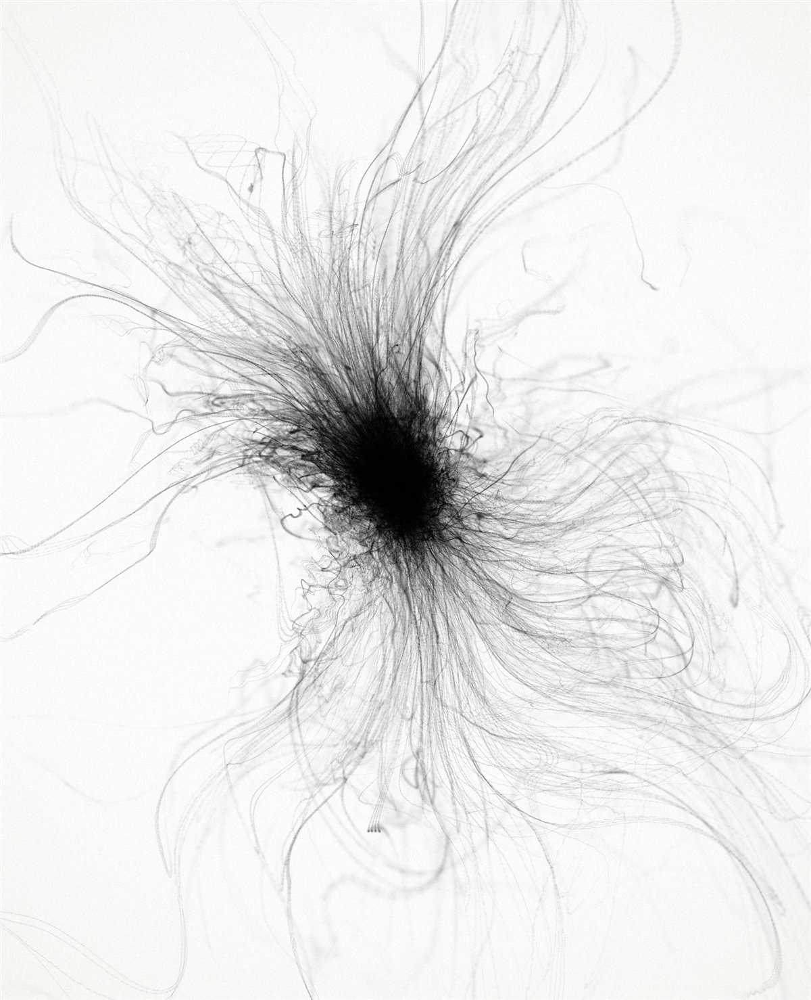
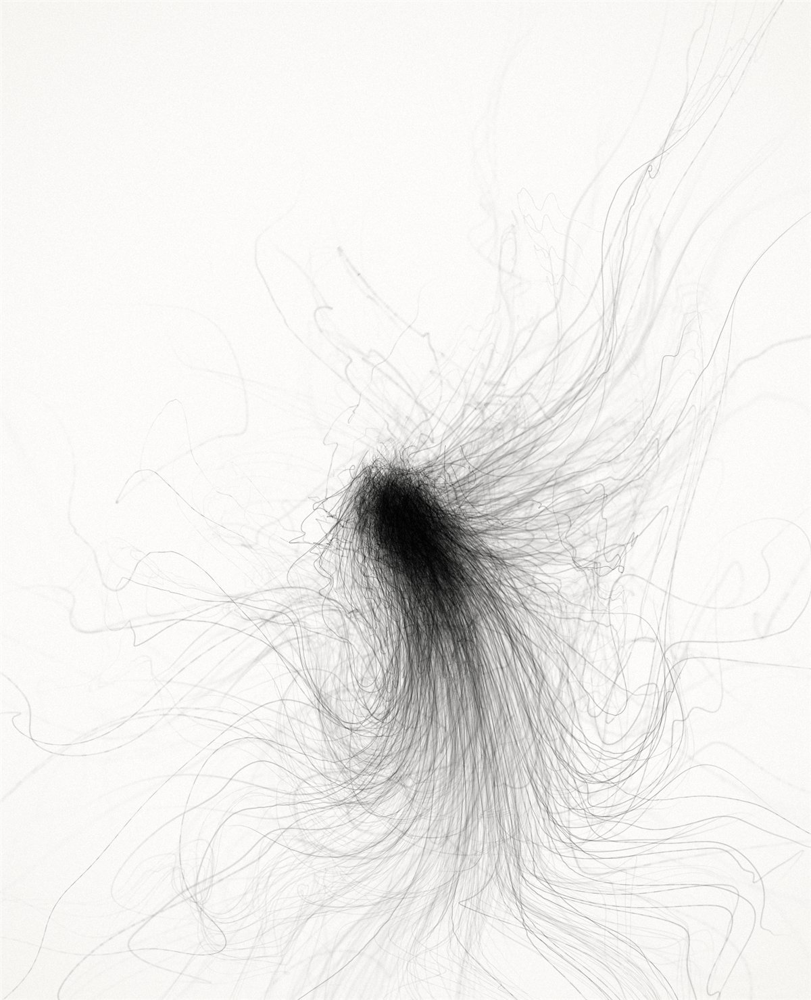
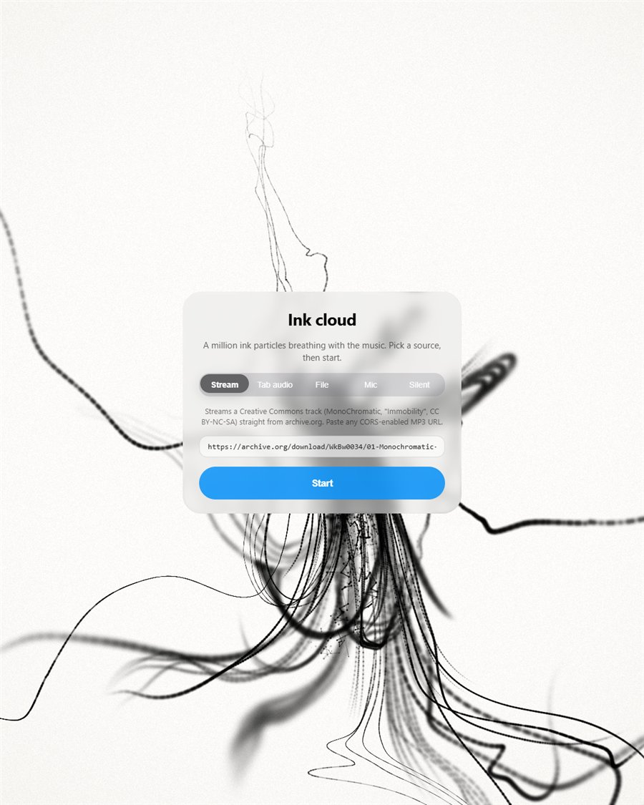

<p align="center">
  
</p>

<h1 align="center">Ink cloud</h1>

<p align="center">
  A million particles of ink on paper, breathing with the music.<br>
  Every beat inhales the cloud into its core; the flow lets it bloom again.
</p>

<p align="center">
  <a href="https://tomacco.github.io/ink-cloud/"><b>Live demo</b></a> &nbsp;·&nbsp;
  <a href="https://github.com/tomacco/ink-cloud/actions/workflows/ci.yml"></a>
</p>

---

**Press and hold** anywhere: the ink gathers around your finger. Keep holding for two seconds and the controls appear. From there you can pick a sound source, open the settings, or hide everything again (`H` on a keyboard, the eye button on a phone). `Space` pauses.

## Sound

| Source | What happens |
| --- | --- |
| **Stream** | Plays a Creative Commons track straight from archive.org (MonoChromatic, *Immobility*, CC BY-NC-SA). Any MP3 URL with CORS headers works. Nothing is downloaded up front. |
| **Tab audio** | Play [*Lumen Chamber* by Deescawa](https://www.youtube.com/watch?v=Rx2IqPD5BMs), the track this piece was made for, in another tab. Pick that tab, tick *Share tab audio*, and the cloud reacts live. Desktop Chrome and Edge only; nothing is re-hosted. |
| **File** | A local file, played from disk. |
| **Mic** | Whatever the microphone hears. |
| **Silent** | No audio. The manual BPM clock in the settings drives the beat. |

Beats come from spectral flux on the 40 to 150 Hz band with an adaptive threshold (mean + k·std over the last second) and a refractory period. Overall loudness nudges the turbulence, the high band sharpens the core detail.

## How it is drawn

<p align="center">
  
  
</p>

Dots never look like ink, strokes do. Each of 4096 *emitters* in the core releases 256 particles one after another; they ride a slowly evolving curl-noise flow and are drawn as capsules joining each particle to the next older one on its line. The result is a continuous streakline: long filaments, parallel ribbons when four emitters sit side by side, and a crackly dendritic core from short-lived emitters that wiggle in a high-frequency octave.

```mermaid
flowchart LR
  A[Simulation<br>positions + velocities<br>in float textures] --> B[Stroke pre-pass<br>one fragment per particle:<br>screen segment, width, ink]
  B --> C[Thin strokes<br>full-res density]
  B --> D[Wide strokes<br>0.35x density]
  C --> E[Composite<br>1 - exp(-density · k)<br>paper · vignette · grain]
  D --> E
  F[AnalyserNode<br>spectral flux] --> G[Beat envelope<br>attack / release]
  G --> A
  G --> B
```

- **Ink on white** is additive density in a float buffer, mapped to darkness with `1 - exp(-density · k)`. Nothing is alpha-blended on white, so overlapping strands go black the way real ink does.
- **Depth of field** widens strokes away from the focal plane while conserving their ink, so out-of-focus strands become faint soft smears. Wide strokes skip particles and render into a small buffer, where their fill cost is a fraction.
- **The beat** is a reversible contraction applied per ribbon in the stroke pass, plus a small lasting velocity pull toward the core. Pure velocity pulls looked like a hard snap and compressed the cloud into a blob within seconds.
- **Streaklines need a slow field.** Two particles emitted 20 ms apart follow the same path only if the flow does not change much between them. Fast time variation stretches lines exponentially; it took measuring neighbour gaps on the GPU to see it.

## Running it

```sh
bun install
bun run dev        # http://localhost:5190
bun run build      # dist/, deployed to GitHub Pages by the workflow
```

Useful URL flags: `?hud=1` shows the controls at once, `?panel=1` shows them with the settings open, `?tex=512` sets the particle texture side (512² = 262k, 1024² = 1M), `?bpm=120` runs the manual clock, `?touch=0.3,0.5` holds a virtual finger, `?p.<param>=<value>` presets any tunable from `src/params.ts`, `?bench=<name>&debug=1` prints GPU pass times and beat statistics.

## Performance

Measured with GPU timer queries on an Intel Arc iGPU (Meteor Lake) at 1629 × 2007 device pixels:

| Pass | 1M particles | 262k particles |
| --- | ---: | ---: |
| Simulation (curl noise, 12 gradient-noise evaluations per particle) | 4.9 ms | 3.9 ms |
| Stroke pre-pass | 1.9 ms | 1.2 ms |
| Strokes (instanced capsules, two buffers) | 13 ms | 9.8 ms |
| Composite | 0.5 ms | 0.9 ms |

The stroke pass is bound by vertex invocations, not fill. Adaptive mode lowers the internal render scale first and then the particle count; phones start at 262k. The glass toolbar costs around 9 ms per frame on this GPU because Chromium re-renders its backdrop filter every frame, which is why hiding the interface is one key away.

## Tuning

Open the settings (sliders icon). Start with these:

- **Beat response**: `render squeeze` is the reversible inhale, `attractor strength` the lasting pull, `attack` and `release` the envelope.
- **Core**: `core-detail share`, `core life`, `core detail strength` (keep it tiny, it stretches lines).
- **Filaments**: `curl scale` for gentler or tighter bends, `curl speed` (keep under 0.05 or lines shred), `outward speed`, `ribbon share`.
- **Depth**: `DOF blur`, `soft smear share`, `soft smear size`.
- **Darkness**: `ink density k`.

## Built with

[Three.js](https://threejs.org) on WebGL2 · [amazing-glass](https://github.com/tomacco/amazing-glass) for the liquid-glass controls · [lil-gui](https://lil-gui.georgealways.com) · simplex noise with analytic gradients by Ashima Arts and Ian McEwan (MIT) · Vite + TypeScript + Bun.

MIT licensed. The default stream is CC BY-NC-SA by MonoChromatic; swap the URL for anything you have the rights to.
